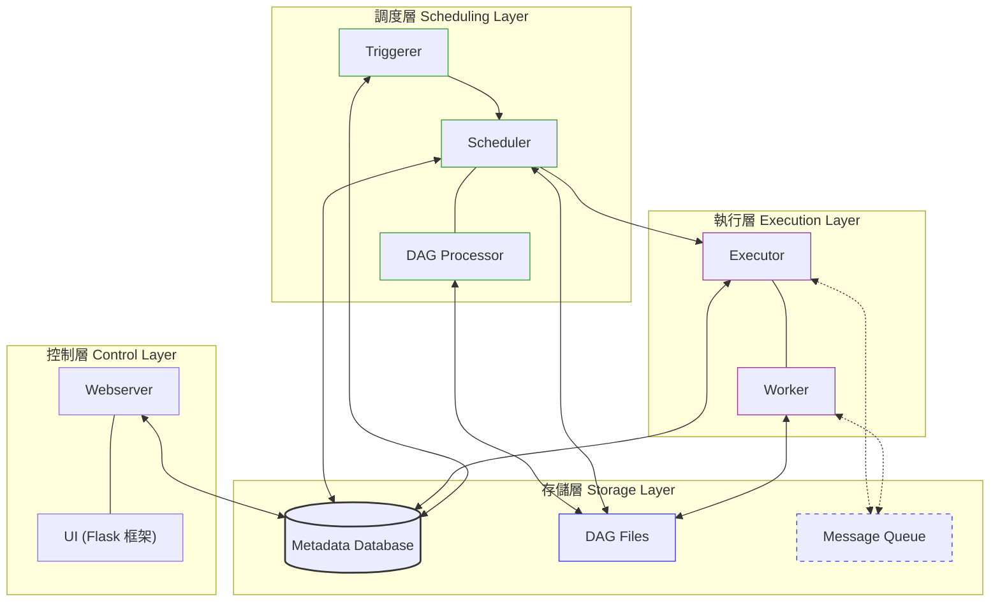

# DataFlow

A comprehensive data pipeline system built with Apache Airflow for collecting, processing, and analyzing financial data and news articles. This project automates the collection of stock information, news articles, and provides notification capabilities through various channels.

## Project Overview

DataFlow is designed to streamline the collection and processing of financial data and news articles. It leverages Apache Airflow's scheduling capabilities to automate various data collection tasks, including:

- Stock market data collection and analysis
- Chinese news article crawling from multiple sources
- Notification delivery through Discord and Line
- Google Trends data collection
- Google Play game pre-registration and new releases collection (支援 Google Play、QooApp 多來源，自動去重)

## Technical Highlights

### Interesting Techniques

- **Web Scraping with BeautifulSoup**: Implements sophisticated [HTML parsing](https://developer.mozilla.org/en-US/docs/Web/API/Document_Object_Model/Introduction) techniques to extract structured data from news websites.
- **Asynchronous Task Scheduling**: Utilizes Airflow's [DAG (Directed Acyclic Graph)](https://airflow.apache.org/docs/apache-airflow/stable/concepts/dags.html) structure to manage complex task dependencies and scheduling.
- **Data Transformation Pipelines**: Converts raw scraped data into structured formats suitable for analysis and storage.
- **Containerization**: Uses Docker to ensure consistent deployment environments across different systems.
- **Regular Expression Processing**: Employs [regex patterns](https://developer.mozilla.org/en-US/docs/Web/JavaScript/Guide/Regular_Expressions) for text extraction and cleaning.
- **Error Handling and Notification**: Implements robust error handling with automated notifications when tasks fail.

### Notable Technologies

- **Apache Airflow**: Core orchestration engine for scheduling and monitoring workflows
- **TensorFlow/Keras**: Machine learning framework used for predictive models (referenced in stock utilities)
- **MySQL**: Primary database for storing collected data
- **SQLAlchemy**: ORM for database interactions
- **OpenCV**: Computer vision library used for image processing
- **Selenium**: Browser automation for websites that require JavaScript rendering
- **Discord & Line API Integration**: For sending notifications and alerts
- **Google Maps API**: For geolocation services
- **OpenCC**: For Chinese text conversion between different character sets

## Project Structure

```
.
├── dags/                   # Airflow DAG definitions
│   ├── common/             # Common utilities and configurations
│   ├── credit_cards/       # Credit card data collection
│   ├── game/               # Game-related data collection (pre-registration & new releases)
│   ├── lib/                # Core library functions
│   ├── news_ch/            # Chinese news collection
│   │   └── news_crawler/   # News crawling modules
│   ├── ptt/                # PTT (Taiwanese forum) collection
│   ├── stock/              # Stock data collection and analysis
│   │   └── error/          # Error handling for stock collection
│   └── youtube/            # YouTube data collection
├── plugins/                # Airflow plugins
│   ├── chromedriver-linux64/ # Chrome driver for Selenium
│   ├── figurine_notify/    # Figurine notification system
│   └── stock/              # Stock-related plugins
├── Dockerfile              # Docker configuration
├── docker-compose.yaml     # Docker Compose configuration
└── requirements.txt        # Python dependencies
```

### Key Directories

- **[dags/](./dags/)**: Contains all the Airflow DAG definitions that orchestrate the data collection and processing workflows.
- **[dags/lib/](./dags/lib/)**: Core library functions used across different DAGs, including database connections, notification systems, and common tools.
- **[dags/news_ch/](./dags/news_ch/)**: Modules for collecting news from various Chinese news sources.
- **[dags/stock/](./dags/stock/)**: Components for collecting and analyzing stock market data.
- **[plugins/](./plugins/)**: Custom Airflow plugins and external tools used by the system.

## External Libraries and Resources

- [Apache Airflow](https://airflow.apache.org/)
- [TensorFlow](https://www.tensorflow.org/)
- [Keras](https://keras.io/)
- [BeautifulSoup](https://www.crummy.com/software/BeautifulSoup/)
- [SQLAlchemy](https://www.sqlalchemy.org/)
- [Selenium](https://www.selenium.dev/)
- [OpenCV](https://opencv.org/)
- [Discord Webhook API](https://discord.com/developers/docs/resources/webhook)
- [Line Notify API](https://notify-bot.line.me/doc/en/)
- [Google Maps API](https://developers.google.com/maps)
- [OpenCC](https://github.com/BYVoid/OpenCC)

## System Requirements

- Docker and Docker Compose
- Python 3.12
- MySQL database
- Chrome browser (for Selenium-based crawling)

## Recent Fixes

### 2025-12-25: 修復新聞收集 UTF-8 BOM 錯誤

修復 `news_ch/news_crawler/module.py` 中 JSON 解析錯誤。當 API 回傳的內容包含 UTF-8 BOM (Byte Order Mark) 時，直接使用 `.json()` 會導致 `JSONDecodeError`。

**修復方式：**
在所有 API 請求後，解析 JSON 前設定 `response.encoding='utf-8-sig'`，自動處理 BOM。

**影響範圍：**
- `LibertyTimes.get_article_url_from()` (自由時報)
- `Anue.get_article_url_from()` (鉅亨網)
- `UDN.get_article_url_from()` (聯合新聞網)

## Database Maintenance

### 遊戲事前登陸資料表 (pre_registration)

#### 資料來源
- Google Play：透過 Google Search API 搜尋並抓取 Google Play 事前登陸頁面
- QooApp：從 QooApp 新聞標籤頁面抓取事前登錄相關遊戲資訊（https://news.qoo-app.com/tag/%E4%BA%8B%E5%89%8D%E7%99%BB%E9%8C%84）

#### 去重機制
- 根據 `game_id` 去重（保留第一筆）
- 根據 `game_url` 去重（保留第一筆）
- 寫入資料庫前會先檢查現有資料，只寫入新的遊戲

### 遊戲新上架資料表 (new_releases)

#### 刪除重複資料

```sql
-- 方法1: 刪除重複的 game_id，保留 id 最小的記錄
DELETE t1 FROM new_releases t1
INNER JOIN new_releases t2 
WHERE t1.id > t2.id AND t1.game_id = t2.game_id;

-- 方法2: 刪除重複的 game_url，保留 id 最小的記錄
DELETE t1 FROM new_releases t1
INNER JOIN new_releases t2 
WHERE t1.id > t2.id AND t1.game_url = t2.game_url;

-- 方法3: 刪除同時重複 game_id 和 game_url 的記錄
DELETE t1 FROM new_releases t1
INNER JOIN new_releases t2 
WHERE t1.id > t2.id 
  AND t1.game_id = t2.game_id 
  AND t1.game_url = t2.game_url;
```

#### 設定主鍵 (Primary Key)

```sql
-- 檢查現有主鍵
SHOW KEYS FROM new_releases WHERE Key_name = 'PRIMARY';

-- 如果已有主鍵，先刪除
ALTER TABLE new_releases DROP PRIMARY KEY;

-- 設定 game_id 為主鍵（如果 game_id 唯一）
ALTER TABLE new_releases ADD PRIMARY KEY (game_id);

-- 或者設定複合主鍵（game_id + source）
ALTER TABLE new_releases ADD PRIMARY KEY (game_id, source);

-- 如果 id 欄位存在且需要保留為自增主鍵，可以設定 game_id 為唯一索引
ALTER TABLE new_releases ADD UNIQUE INDEX idx_game_id (game_id);
ALTER TABLE new_releases ADD UNIQUE INDEX idx_game_url (game_url);
```

#### 檢查重複資料

```sql
-- 檢查重複的 game_id
SELECT game_id, COUNT(*) as count 
FROM new_releases 
GROUP BY game_id 
HAVING COUNT(*) > 1;

-- 檢查重複的 game_url
SELECT game_url, COUNT(*) as count 
FROM new_releases 
GROUP BY game_url 
HAVING COUNT(*) > 1;
```


