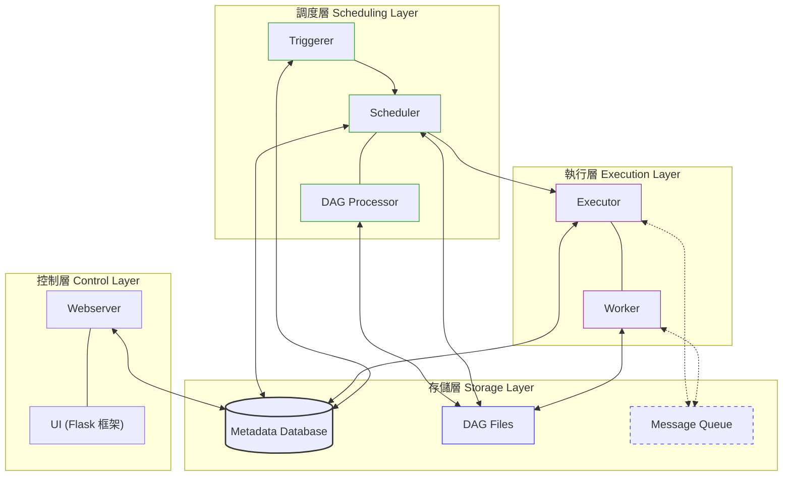

# DataFlow

A comprehensive data pipeline system built with Apache Airflow for collecting, processing, and analyzing financial data and news articles. This project automates the collection of stock information, news articles, and provides notification capabilities through various channels.

## Project Overview

DataFlow is designed to streamline the collection and processing of financial data and news articles. It leverages Apache Airflow's scheduling capabilities to automate various data collection tasks, including:

- Stock market data collection and analysis
- Chinese news article crawling from multiple sources
- Notification delivery through Discord and Line
- Google Trends data collection
- Google Play game pre-registration and new releases collection (支援 Google Play、QooApp 多來源，自動去重)

## Technical Highlights

### Interesting Techniques

- **Web Scraping with BeautifulSoup**: Implements sophisticated [HTML parsing](https://developer.mozilla.org/en-US/docs/Web/API/Document_Object_Model/Introduction) techniques to extract structured data from news websites.
- **Asynchronous Task Scheduling**: Utilizes Airflow's [DAG (Directed Acyclic Graph)](https://airflow.apache.org/docs/apache-airflow/stable/concepts/dags.html) structure to manage complex task dependencies and scheduling.
- **Data Transformation Pipelines**: Converts raw scraped data into structured formats suitable for analysis and storage.
- **Containerization**: Uses Docker to ensure consistent deployment environments across different systems.
- **Regular Expression Processing**: Employs [regex patterns](https://developer.mozilla.org/en-US/docs/Web/JavaScript/Guide/Regular_Expressions) for text extraction and cleaning.
- **Error Handling and Notification**: Implements robust error handling with automated notifications when tasks fail.

### Notable Technologies

- **Apache Airflow**: Core orchestration engine for scheduling and monitoring workflows
- **TensorFlow/Keras**: Machine learning framework used for predictive models (referenced in stock utilities)
- **MySQL**: Primary database for storing collected data
- **SQLAlchemy**: ORM for database interactions
- **OpenCV**: Computer vision library used for image processing
- **Selenium**: Browser automation for websites that require JavaScript rendering
- **Discord & Line API Integration**: For sending notifications and alerts
- **Google Maps API**: For geolocation services
- **OpenCC**: For Chinese text conversion between different character sets

## Project Structure

```
.
├── dags/                   # Airflow DAG definitions
│   ├── common/             # Common utilities and configurations
│   ├── credit_cards/       # Credit card data collection
│   ├── game/               # Game-related data collection (pre-registration & new releases)
│   ├── lib/                # Core library functions
│   ├── news_ch/            # Chinese news collection
│   │   ├── utils.py        # Pure helpers (URL validation, text/time cleanup)
│   │   └── news_crawler/   # 一站一檔（anue.py, ettoday.py, ...），__init__.py 統一匯出
│   ├── ptt/                # PTT (Taiwanese forum) collection
│   ├── stock/              # Stock data collection and analysis
│   │   └── error/          # Error handling for stock collection
│   └── youtube/            # YouTube data collection
├── plugins/                # Airflow plugins
│   ├── chromedriver-linux64/ # Chrome driver for Selenium
│   ├── figurine_notify/    # Figurine notification system
│   └── stock/              # Stock-related plugins
├── Dockerfile              # Docker configuration
├── docker-compose.yaml     # Docker Compose configuration
└── requirements.txt        # Python dependencies
```

### Key Directories

- **[dags/](./dags/)**: Contains all the Airflow DAG definitions that orchestrate the data collection and processing workflows.
- **[dags/lib/](./dags/lib/)**: Core library functions used across different DAGs, including database connections, notification systems, and common tools.
- **[dags/news_ch/](./dags/news_ch/)**: Modules for collecting news from various Chinese news sources.
- **[dags/stock/](./dags/stock/)**: Components for collecting and analyzing stock market data.
- **[plugins/](./plugins/)**: Custom Airflow plugins and external tools used by the system.

## Cursor Agent Skills

本儲存庫在 `.cursor/skills/` 提供專案層級 Cursor Skill（與 Airflow DAG 無關時可忽略）。

| Skill | 說明 |
|-------|------|
| `component-refactoring` | 適用 **Dify 前端** `web/`：高複雜度 React 元件重構（hooks 抽出、子元件拆分、`pnpm analyze-component` / `pnpm refactor-component`）。主檔：`.cursor/skills/component-refactoring/SKILL.md`，細節見 `references/`。 |

## External Libraries and Resources

- [Apache Airflow](https://airflow.apache.org/)
- [TensorFlow](https://www.tensorflow.org/)
- [Keras](https://keras.io/)
- [BeautifulSoup](https://www.crummy.com/software/BeautifulSoup/)
- [SQLAlchemy](https://www.sqlalchemy.org/)
- [Selenium](https://www.selenium.dev/)
- [OpenCV](https://opencv.org/)
- [Discord Webhook API](https://discord.com/developers/docs/resources/webhook)
- [Line Notify API](https://notify-bot.line.me/doc/en/)
- [Google Maps API](https://developers.google.com/maps)
- [OpenCC](https://github.com/BYVoid/OpenCC)

## System Requirements

- Docker and Docker Compose
- Python 3.12
- MySQL database
- Chrome browser (for Selenium-based crawling)

## DAG 執行日誌慣例

- 任務內 `print` 盡量帶 **`[模組或流程名]`** 前綴（例如 `[中文新聞]`、`[stock DAG]`），方便在 Airflow log 搜尋與對照任務。
- **失敗**時除訊息外會標出 **Python 例外類型**（如 `KeyError`、`ConnectionError`），便於區分是網頁改版、連線或資料問題。

## 股票資料回補 (Backfill)

當需要回補特定日期的股票資料時，修改 `dags/stock/config/config.py` 中的 `BACKFILL_DATE`：

```python
# 設定要回補的日期
BACKFILL_DATE = '2026-03-16'
```

**操作步驟：**
1. 設定 `BACKFILL_DATE` 為目標日期（格式 `YYYY-MM-DD`）
2. 在 Airflow UI 手動觸發股票收集 DAG
3. 等待 DAG 完成後，修改為下一個日期，再次觸發
4. 全部回補完成後，將 `BACKFILL_DATE` 改回 `None` 恢復正常排程

**影響範圍：**
- `StockCollectLogic.now_time`：三大法人、個股成交等收集 API 的日期參數
- `is_taiwan_stock_close`：開盤日判斷
- `is_weekend`：週六才執行的任務（大戶比、融資券、月營收）

**注意事項：**
- 回補日若為假日，`is_taiwan_stock_close` 會跳過該日
- 依賴 `really_date`（從 DB 查最新三大法人日期）的任務，會在三大法人資料寫入後自動取得正確日期
- 回補完畢務必改回 `BACKFILL_DATE = None`

## Recent Fixes

### 2026-03-23: news_ch 模組重構

**架構改善：**
- `news_crawler/module.py`（1611 行）拆成一個爬蟲一個檔案（16 檔），由 `__init__.py` 統一匯出；`all_news.py` / `save_money.py` 改為 explicit import

**Bug 修復：**
- `base_process.py` — `_headers` 原為 class attribute（共用 mutable dict），任一爬蟲修改 `Referer` 會影響其他爬蟲；改為 `__init__` 內建立 instance attribute，每個實例獨立
- `base_process.py` — `_now_time` 原在 class 定義時就固定，改為實例建立時計算，`create_time` 更準確

**清理：**
- `save_money.py` — 移除 3 處不必要的 `global table_name`（函式內只讀取模組變數，無需 global）

### 2026-03-21: DAG 日誌優化與月營收重試修正

- **日誌：** 調整 `dags/` 內多數 `print` 為簡短中文說明並帶前綴；錯誤時輸出例外類型與訊息。
- **Bug：** `StockMonthRevenueCollectProcess.collect` 在錯誤重試迴圈中誤呼叫 `get_margin_data`（融資券），已改為 `get_month_revenue`，否則重試無法補齊月營收。

### 2025-02-20: 修復事前登錄遊戲重複通知

修復 `game/pre_registration.py` 中 `pre_registration_tmp` 未在無新遊戲時清空，導致每次 DAG 執行都重複發送相同遊戲通知。

**問題：** `write_to_sql` 僅在 `new_df` 非空時才更新 `pre_registration_tmp`，無新遊戲時 tmp 保留上次資料，`notify_new_games` 每次讀取 tmp 都會重複通知。

**修復方式：** 將 `pre_registration_tmp` 的更新移出 `if not new_df.empty` 區塊，無論有無新遊戲都執行 `replace`，無新遊戲時以空表覆蓋 tmp。

**影響範圍：** `game/pre_registration.py` (write_to_sql)

### 2025-02-18: 修復 Google Play 事前登錄遊戲抓取不全

修復 `game/pre_registration.py` 中 Google Play 事前登錄遊戲抓取不全問題。

**問題：**
- `parse_search_results` 僅比對 `title in ['Pre-registration games', 'Google Play']`，搜尋結果標題可能不符
- 部分遊戲圖片僅有 `src` 無 `srcset`，被過濾掉
- 未處理 lazy loading，捲動後才載入的遊戲抓不到

**修復方式：**
- 新增固定 URL `GOOGLE_PLAY_PRE_REG_URL` 作為 fallback
- `parse_search_results` 改為比對 URL 含 `promotion_3000000d51_pre_registration_games`，無匹配則用固定 URL
- `fetch_google_play_pre_registration`：img 改為 `srcset or src`、移除 img 必填、加入捲動載入 lazy content、game_id 正確處理 `&` 後參數

**影響範圍：**
- `game/pre_registration.py` (Google Play 事前登錄收集)

### 2025-12-23: 修復 save_money TVBS_SaveMoney IndexError

修復 `news_ch/news_crawler/module.py` 中 `TVBS_SaveMoney.get_article_url_from()` 方法的 `IndexError`。當網頁找不到包含 `itemListElement` 的 JSON-LD script 標籤時，列表推導式返回空列表，訪問 `[0]` 會導致錯誤。

**修復方式：**
- 先將列表推導式結果存儲到變數
- 檢查列表是否為空，為空則返回空的 DataFrame 並記錄錯誤訊息
- 檢查 `article_id_list` 是否為空，避免 SQL 查詢錯誤

**影響範圍：**
- `TVBS_SaveMoney.get_article_url_from()` (TVBS 優惠好康情報)

### 2025-12-25: 修復新聞收集 UTF-8 BOM 錯誤

修復 `news_ch/news_crawler/module.py` 中 JSON 解析錯誤。當 API 回傳的內容包含 UTF-8 BOM (Byte Order Mark) 時，直接使用 `.json()` 會導致 `JSONDecodeError`。

**修復方式：**
在所有 API 請求後，解析 JSON 前設定 `response.encoding='utf-8-sig'`，自動處理 BOM。

**影響範圍：**
- `LibertyTimes.get_article_url_from()` (自由時報)
- `Anue.get_article_url_from()` (鉅亨網)
- `UDN.get_article_url_from()` (聯合新聞網)

## Database Maintenance

### 遊戲事前登陸資料表 (pre_registration)

#### 資料來源
- Google Play：使用固定 URL `promotion_3000000d51_pre_registration_games`（搜尋 API 為輔，無匹配時 fallback）
- QooApp：從 QooApp 新聞標籤頁面抓取事前登錄相關遊戲資訊（https://news.qoo-app.com/tag/%E4%BA%8B%E5%89%8D%E7%99%BB%E9%8C%84）

#### 去重機制
- 根據 `game_id` 去重（保留第一筆）
- 根據 `game_url` 去重（保留第一筆）
- 寫入資料庫前會先檢查現有資料，只寫入新的遊戲

### 遊戲新上架資料表 (new_releases)

#### 刪除重複資料

```sql
-- 方法1: 刪除重複的 game_id，保留 id 最小的記錄
DELETE t1 FROM new_releases t1
INNER JOIN new_releases t2 
WHERE t1.id > t2.id AND t1.game_id = t2.game_id;

-- 方法2: 刪除重複的 game_url，保留 id 最小的記錄
DELETE t1 FROM new_releases t1
INNER JOIN new_releases t2 
WHERE t1.id > t2.id AND t1.game_url = t2.game_url;

-- 方法3: 刪除同時重複 game_id 和 game_url 的記錄
DELETE t1 FROM new_releases t1
INNER JOIN new_releases t2 
WHERE t1.id > t2.id 
  AND t1.game_id = t2.game_id 
  AND t1.game_url = t2.game_url;
```

#### 設定主鍵 (Primary Key)

```sql
-- 檢查現有主鍵
SHOW KEYS FROM new_releases WHERE Key_name = 'PRIMARY';

-- 如果已有主鍵，先刪除
ALTER TABLE new_releases DROP PRIMARY KEY;

-- 設定 game_id 為主鍵（如果 game_id 唯一）
ALTER TABLE new_releases ADD PRIMARY KEY (game_id);

-- 或者設定複合主鍵（game_id + source）
ALTER TABLE new_releases ADD PRIMARY KEY (game_id, source);

-- 如果 id 欄位存在且需要保留為自增主鍵，可以設定 game_id 為唯一索引
ALTER TABLE new_releases ADD UNIQUE INDEX idx_game_id (game_id);
ALTER TABLE new_releases ADD UNIQUE INDEX idx_game_url (game_url);
```

#### 檢查重複資料

```sql
-- 檢查重複的 game_id
SELECT game_id, COUNT(*) as count 
FROM new_releases 
GROUP BY game_id 
HAVING COUNT(*) > 1;

-- 檢查重複的 game_url
SELECT game_url, COUNT(*) as count 
FROM new_releases 
GROUP BY game_url 
HAVING COUNT(*) > 1;
```


